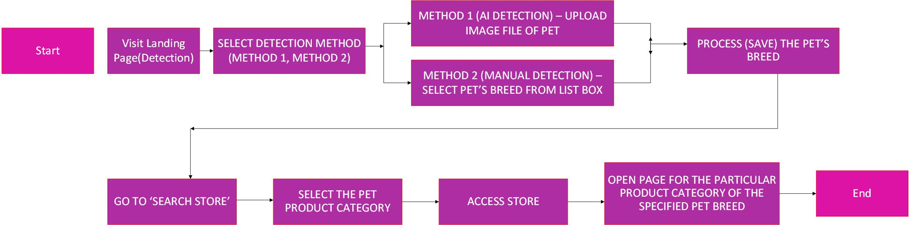
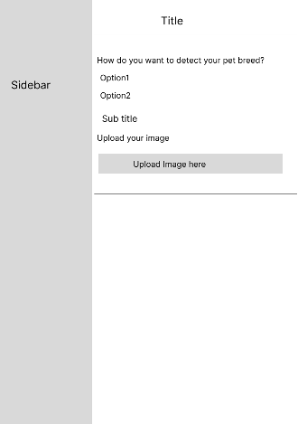
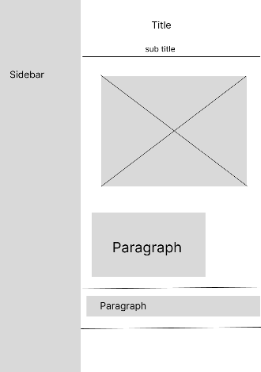
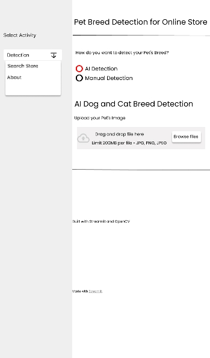
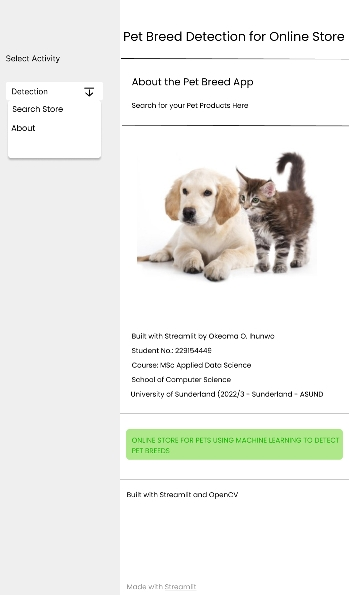
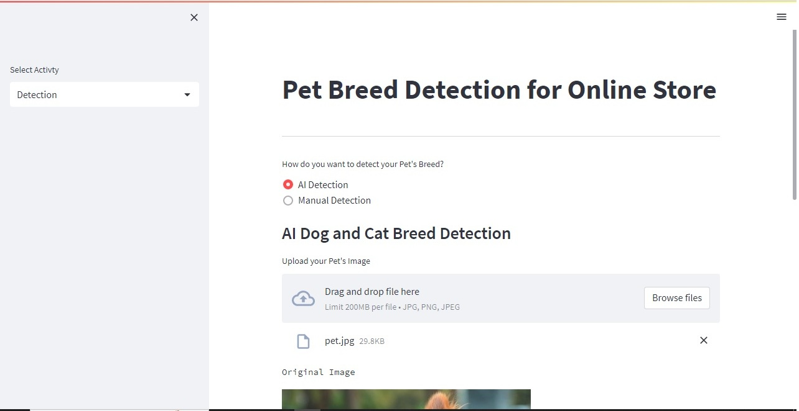
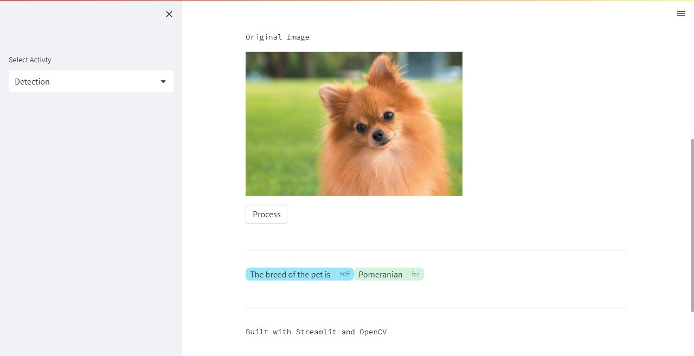
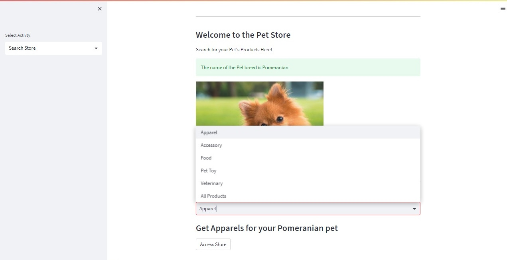
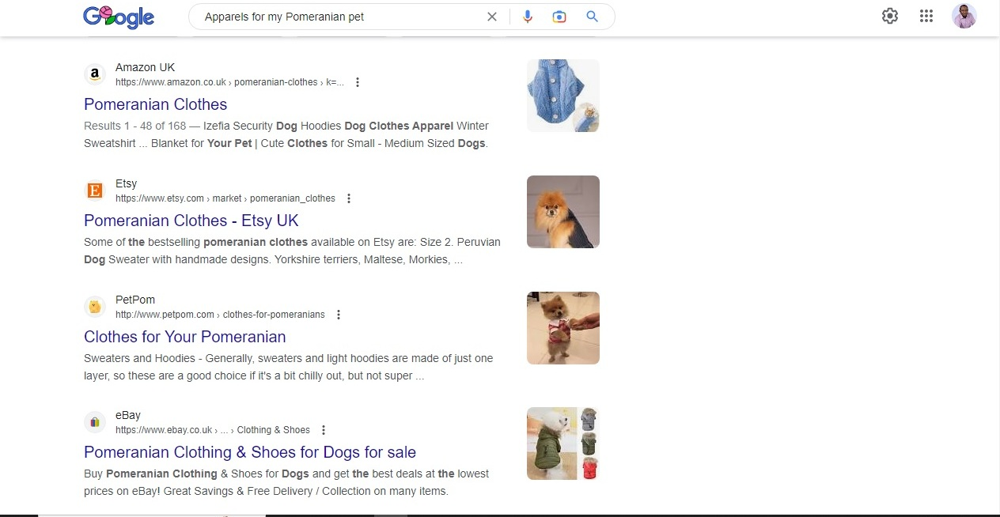
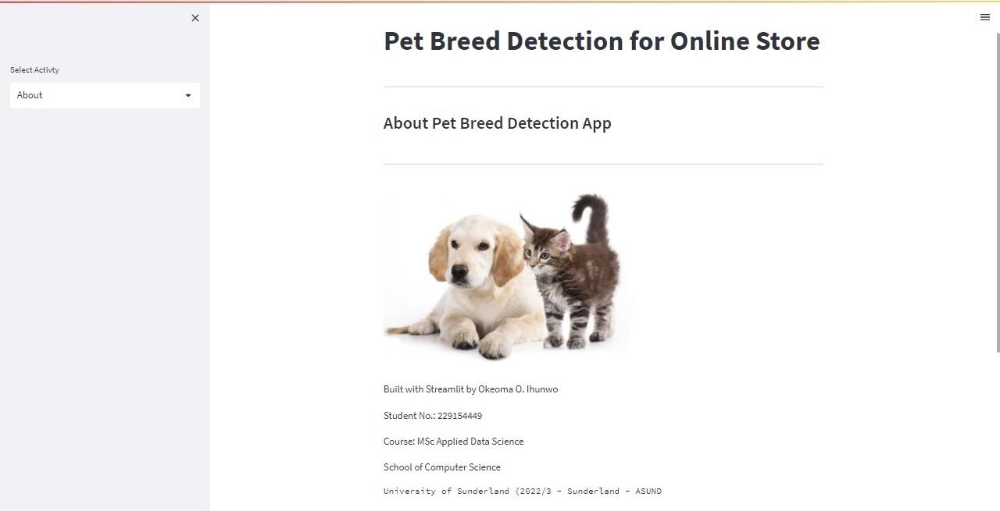

# Dog and Cat Breed Detection
The goal of the project is to give pet owners a personalized shoping experience by help them predict their dog or cat breeds.

# _Tobic:_ Online Store Creation Using Python, Google's AutoML and Streamlit Library for Pet Breed Recognition
Course Title: CETM46 – Data Science Product Development: A Domain Specific Data Science Product Development Project, Product Prototype and Project Report.

**You can access the application & notebook files, models and dataset by using the link: https://drive.google.com/drive/folders/1KonqFtlH5PtHwaYL6ALnh0BvMhebaTix?usp=sharing**  

## Table of Contents

- [Description](#description)
- [Dataset](#dataset)
- [Program Consideration](#program-consideration)
- [Model Development](#model-development)
- [Model Integration](#model-integration)
- [Running Notebook](#running-notebook)
- [Running Application](#running-application)
- [Libraries](#libraries)
- [Application Interfaces](#application-interfaces)
- [Credits](#credits)

## Description
**Project Overview:**

It is particularly challenging for online pet stores, where customers need to manually search for the right products for their pets based on their breed. The problem also concerns pet owners who struggle to find the right products for their pets. However, pet store owners want to provide a more personalized shopping experience for their customers. Identifying the breed of pets from their images is one of the problems this application will address with the developed data science product. 
Before the product development began, the first step was to design a Gantt chart that showed the different processes and stages of the development to enable me keep track of the time frame of the product which was stipulated to be a two (2) months project. It was updated regularly until all the stages of the product were completed. In the end, the Gantt chart was very useful in making sure the project finished at the stipulated time.
The task is broken down into two major stages: 
1.	Model Development: Developed an optimized machine learning model that can accurately identify the breed of pets from their images. 
2.	Model Integration: Integrated the model into an online pet store, where customers can upload their pet’s image and receive personalized product recommendations based on their pet’s breed.

## Dataset
**Oxford-IIIT Pet dataset:**

The Oxford-IIIT Pet dataset was used to train the model. The dataset can be downloaded using the link: https://www.kaggle.com/zippyz/cats-and-dogs-breeds-classification-oxford-dataset available on Kaggle (contains suitable format for the project). The dataset has a total of 7390 images of pets that can be classified into 37 breeds (or, in this context, classes). However, there were six (6) bad images in the dataset that was not opening via code, therefore the 6 images were excluded from the rest of the images leaving the final total as 7384.

The dataset was split into train and test sets using the stratified split method on the test data. This meant that the ration between the numbers of images in each class was equal in the testing set.

## Program Consideration
**Requirements and considerations for the model development:**

1.	Dataset Breed (Class): The number of images per breed did not vary a lot in the dataset, which is good. Even though the difference between the number of cat and dog images is a lot (from the good images, we had 4990 for dogs and 2394 for cats), it was not a problem since the classifier is not focused on deciding whether the image is that of a cat or a dog but their breeds.
2.	Similar Features: Because this problem is considered one of fine-grained image classification — it aims to distinguish between classes with very similar features — classic methods of machine learning wouldn’t make the cut. Therefore a more suitable model for detecting the similarity and differences of highly complex features of images must be employed.
3.	Computational Requirement: The techniques are very computationally expensive and therefore take a long time to perform depending on the capacity of the workstation.

## Model Development
**Tools and stages for Model development:**

Jupyter notebook was used as the development platform while Python was used as the programming language.

**Type of Model Employed:**

Convolutional Neural Networks (CNN) was used for model training: The general opinion is that CNN are the most viable for problems involving large quantities of complex data from which abstract features like form and colour must be obtained to get accurate results.
The get the best result from the model, the process also involved Transfer Learning method.

**Transfer Learning method:**

Transfer Learning was used to improve the model’s performance and also reduce the computational complexity of the training. Keras InceptionV3 architecture pre-trained on the imagenet data set was used as a starting point. The architecture is composed of multiple combinations of different layers, including convolution layers, batch normalization layers, and pooling layers. The steps involved freezing these layers to avoid destroying the information they already have during the fitting phase; and adding some new layers to it.
The base model was used as a framework to understand common features in image classification tasks, such as shapes and colours. The premise is that these features are going to be similar for every image, and thus we can save some time reusing their previously calculated weights. On the other hand, the new layers served the purpose of adapting the model to the new more specific features and thus allowing the model to make predictions on our new and specific Oxford-IIIT Pet dataset.
In order to make the model robust and avoid over-fitting, the model was improved further by unfreezing some of the last layers of the previously trained model, in a process called fine-tuning. 
For the purpose of improving the model further, specific layers was attached to the end of the base model for various reasons:

-	Pooling Layer: This is the layer that will interact directly with the output of the InceptionV3 layers. Pooling layers are used to down-sample the inputs by applying a filter that will form pixel groups and apply an operation on them. In our case, Average Pooling was used, which calculates the average of those pixel groups.
-	Dense Layer: A single connected layer with a specified number of neurons — 256 in our case. The activation function chosen was ReLU, which simply maps any negative input to 0 and any positive input to itself. It is widely used because it is a linear function for positive input and does not have any risk of saturation.
-	Dropout Layer: The purpose of which is to ignore randomly a certain percentage of outputs from the previous layer depending on a regularization parameter. The goal of this layer is to prevent over-fitting of data.
-	Batch Normalization Layer: Was applied for the purpose of scaling the output in order so that it had a mean of 0 and a standard deviation of 1.

_Dense Layer_: This is the output layer, a fully connected one, with 37 neurons, each corresponding to one of the classification classes. Here a **SoftMax** activation function is used. This is a better activation function for a multi-classification problem when compared to a logistic function, like sigmoid. This is because SoftMax outputs a probability vector with each class corresponding to a value, allowing us to easily understand what classes have higher values — and more probability of being the correct ones.
A new input layer was added to the model, to prepare the images to conform to the right format so that it can be passed to the InceptionV3 model. This layer interacts directly with the input data and rescales every value it receives to a value between -1 and 1.
The optimizer chosen was **Adam**, and implemented with stochastic gradient descent, which has a default learning rate of 0.001 — it was varied later on to 0.01. Accuracy metric was used to evaluate the model performance during training. Keras library made it very easy to assemble the model using this architecture.

**Hyper-parameter Optimization:**

Hyper-parameter was employed by changing the learning rate and dropout value to influence the model’s capabilities in order to improve the settings.

**K-Fold Cross-Validation:**

Even though the most common number of folds are sometimes from 5 to 10, three (3) folds was used in the cross validation, due to the time the process takes.  A batch size of 32 and 15 epochs was also utilized because of time constraints.

**Model Evaluation:**

The test set constituted 30% of the total data set, which corresponded to 2216 images. We can finally use it to check the accuracy of the model especially after discovering the best hyper-parameters.
The initial evaluation was done after model was created and trained on the Oxford-IIIT Pet dataset. A batch size of 32 and 15 epochs was employed before it was used to predict the test data and convert the values from decimal values to one-hot encoding which corresponds to the ID of the predicted breed which is then used to visualize the results.

**Visualizing the model evaluation values:**

One interesting way to visualize how good the model predicts the images is by using confusion matrix.  It is a very nice way to understand cases where the model is predicting wrongly. A heat map representation of the matrix was also used for better visualization.

**Saving and re-loading model:**

For the purpose of using the trained model later for detecting pet breeds or for further training, the model was saved and reloaded using the ‘model.save’ and ‘models.load_model’ commands from Keras library respectively. Also ‘early stopping’ callback option was used to select the best performing epoch while training.

**Google's AutoML**

Google's AutoML can be used for the purpose of confirming predicted values or to support predictions.
Google's AutoML from Vertex AI can be employed to support the developed model. The following steps can be used to create a vertex AI endpoint for detecting pet breed by training with AutoML using the Oxford-IIIT dataset.
1.	Prepare the Oxford-IIIT dataset dataset for AutoML object detection
2.	Upload dataset in compliance with AutoML
3.	Train an object detection model with dataset.
4.	Create an endpoint and then use the created endpoint to get the label with the highest confidence level for detecting the breed of a pet in an image.
With the display name of the endpoint, you can integrate it to a website to detect the dog and cat breeds from an image. Because of the cost of running a Google AutoML in the Google cloud platform (GCP), this option was not implemented but it should be considered.

## Model Integration
**Integration of the Model to the front end of the product**

This phase of the data science product development deals with the integration of the model to the website. The primary end users of the product are majorly for online pet (dogs and cat) store owners.  The stages involved for the integration are as follows:
1.	Draft a User story and Acceptance Criteria
2.	Design a User Journey
3.	Design a wireframe and prototype for the product using Figma app
4.	Develop the website with Python, Streamlit and OpenCV.
5.	Integrate the model to the website
6.	Deploy the website and start detecting pet breeds and recommending pet products.
7.	Quality Assurance and User Testing
8.	Evaluation plans and methods

**Draft a User story and Acceptance Criteria**

**User Story:** As a regular user searching for products online for my pet (dog or cat), I want to be able to know my pet breed so that I can order precise products such as Apparels, Accessories, Food items, Pet toys and also get Veterinary care for my pet in a timely manner.

**Acceptance Criteria:**

1.	User can access the landing page - ‘Detection’ of the application by accessing the online website or by running it locally from the terminal or command prompt. 
2.	User selects ‘AI Detection’ option to enable the upload of a pet’s image or ‘Manual Detection’ to pick the pet’s breed from a list box if already known by the user and then processes it to detect and save the breed.
3.	User selects ‘Search Store’ page and then chooses any of the following categories from a list box; Apparels, Accessories, Food items, Pet toys, Veterinary care and All products to begin the search for a tailored pet product.
4.	The user selects the ‘Access store’ button which processes all the inputs and gives the user the webpage with links of the specific products that is being sought after by the user.  

Because this is a bespoke product meant to showcase the different stages of the product development, the various categories of the store ‘Access store’ button were linked to Google search engine with the specified search information instead of an e-commerce site were merchant products are displayed. 

**Design a User Journey**

A pictorial repesentation of the steps to be followed while using the webapp.

**Design a wireframe and prototype for the product using Figma app**

A wireframe and prototype of the product was designed with Figma. Figma, a digital prototyping tool, was used to design the user interface and demonstrate how the product will work. The prototype demonstrated how a sample image was uploaded to the website and how the model was able to identify the breed of the pet before product recommendations were made in the store section.

**Wireframe (Low-Fidelity)**

The three pages below are the Detection page, Search store page and the About page respectively.

 |  | 

**Prototype (High-Fidelity)**

The three pages below are the Detection page, Search store page and the About page respectively.

 |  | 

**Develop the website with Python, Streamlit and OpenCV**

The product was developed with Python programming language and some important libraries that were required for the application to work effectively. Some of the most vital libraries utilized are Streamlit and OpenCV (Open Source Computer Vision Library). Streamlit was used to design and create the features of the various aspects of the website while OpenCV was required for performing image processing and computer vision tasks. It provided the means by which the application was able to implement object detection using pet images. All the programme codes were written in a python script file named app.py.

**Integrate the model to the website**

The path of the trained model was copied and attached in a function for re-loading the model for detection of the pet’s breed when the ‘AI Detection’ option is activated. However, endpoint from a trained model from Google AutoML could also be integrated to the website to further provide more option for the user for automatically detect the pet’s breed as well as confirm the initial model’s prediction.
Deploy the website and start detecting pet breeds and recommending pet products
The application can be deployed in two ways for demonstration purposes but the final plan is the eventual hosting with a domain name after it most have been integrated to live online merchants pet’s store(s).
It is necessary to install all the required libraries before running the application. The required library names are located in the **Libraries** section of the README.md file. **Running Application** section shows the steps required for the user to run the application.

**Quality Assurance and User Testing**

User acceptance testing (UAT) was performed by the prospective end-users to ensure that the software system meets their requirements and is easy to use. We approached some pet owners in our neighbourhood and requested for their cooperation by getting pictures of their pets to test the application and the response was encouraging. This we plan to do from time to time until the software system is released to production.
Other testing methods that were performed during development were Unit test, Integration test, System test and Acceptance test. 

**Evaluation plans and methods**

For the purpose of evaluation, feedback from end-users about the software being developed was gathered in order to identify any usability issues or bugs that may be affecting the user experience, and to make necessary improvements to the software before it is released to the public.

## Running Notebook
**To run the Jupyter Notebook, follow the steps below:**

There is only one notebook file that was used for training and developing the models. The notebook can be run by saving the folder containing the notebook and running it in various ways such as using Anaconda application, uploading the file to Google Colab or running it with locally install notebook using 'pip'.

- Open command prompt or terminal and type the following: 
`pip install --upgrade pip`; To the current version of pip;
`pip install jupyter notebook`; To install Jupyter Notebook.**
- Save the folder containing the file you want to run into your system.
- Navigate or cd into the folder. The jupyter file name is 'Object_recognition.ipynb' in command prompt or terminal.
- Install the required libraries needed for the application if they are not already installed (See **libraries** section).
- Run the command: `jupyter notebook` or enter `python -m notebook` to open the notebook in the browser. Select the jupyter file to access the codes and run the application.

## Running Application
**Steps for running the application:**

**You can access the application & notebook files, models and dataset by using the link: https://drive.google.com/drive/folders/1KonqFtlH5PtHwaYL6ALnh0BvMhebaTix?usp=sharing**  

**Deploying the application locally:**

The application is run locally by typing the stremlit command in the terminal or command prompt (`streamlit run app.py`) from the folder containing the python file and the saved model. However, this will only run smoothly when all the required libraries has been installed.

**Deploying the application online via ngrok**

In this method, Google cloud platform is used to run the streamlit app. A registration in the ngrok website (https://ngrok.com) is needed to get an authentication token that is required to lunch the web app on the internet using the system local port number, 8501.
For the application to run effectively, Google drive will first be mounted in the Google Colab notebook for the purpose of loading the model and image file from the drive (They must first be saved in the Google drive and the path copied to be pasted in the code).
All the cells in the Google Colab notebook must be run from the beginning to the end to access the url that is needed to access the website from the internet.

## Libraries
**Install the following libraries from the command prompt or terminal before running the application:**
- `pip install streamlit`
- `pip install numpy`
- `pip install opencv-python`
- `pip install pillow`
- `pip install tensorflow`
- `pip install st-annotated-text`

**_Note:_ You can use either pip or pips for the installation of the libraries**

## Application Interfaces

1. Detection Page1: Showing the two options for detecting a pet breed (Manual or AI)

Detection Page1

2. Detection Page2: Showing the processed breed with the AI detection method applied

Detection Page2

3. Search Store: Showing the page for selecting products that are specific to the selected breed

Search Store1

4. Search Store: Showing the search results from google as an example of personalized product recommendations based on the breed

Search Store2

5. About Page: Showing the details of the product's developer to who this project is credited to.

About

## Credits

This Project was Designed by Okeoma O. Ihunwo. It is a Domain Specific Data Science Development project for Assignment 2 (CETM46) for 2022/2023 session.

